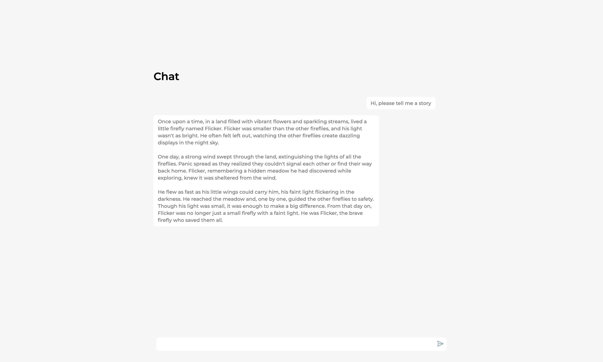

# Simple Chat UI

A simple, modern React chat interface built with Vite, TypeScript, and Tailwind CSS (using shadcn/ui components). It's designed to connect to a backend API for streaming chat responses.

Mostly intended for quick local prototyping of LLM pipelines.

## Features

*   Clean, responsive chat interface.
*   Sends chat history to the backend.
*   Handles streaming responses from the backend.
*   Uses environment variables for configuration.
*   Built with modern web technologies (React, Vite, TypeScript, Tailwind CSS).

## Screenshots



## Prerequisites

*   Node.js (v18 or later recommended)
*   npm or yarn
*   A running backend chat service (see **Backend Requirement** below)

## Installation

1.  **Clone the repository:**
    ```bash
    git clone https://github.com/robbertmanders/simple_chat_ui.git
    cd simple_chat_ui
    ```
2.  **Install dependencies:**
    ```bash
    npm install
    # or
    yarn install
    ```

## Configuration

This project requires environment variables to configure the backend API endpoint.

1.  Copy the example environment file:
    ```bash
    cp .env.example .env
    ```
2.  Edit the `.env` file and set the **required** `VITE_BACKEND_API_URL` and `VITE_BACKEND_API_PATH` variables.
    ```dotenv
    # .env
    # Example:
    VITE_BACKEND_API_URL=http://127.0.0.1:8000
    VITE_BACKEND_API_PATH=/chat
    ```
    The application will not work correctly if these are not set.

## Running Locally

Start the development server:

```bash
npm run dev
# or
yarn dev
```

This will start the frontend on `http://localhost:5173`.

## Backend Requirement

This repository contains **only the frontend UI**. You need a separate backend service that provides a chat API endpoint.

**API Contract:**

*   **Endpoint:** The frontend will send requests to the full URL constructed from `VITE_BACKEND_API_URL` + `VITE_BACKEND_API_PATH` (e.g., `http://127.0.0.1:0/chat`).
*   **Method:** `POST`
*   **Request Body:** A JSON object containing the message history:
    ```json
    {
      "messages": [
        { "id": "string", "content": "string", "isUser": boolean },
        // ... more messages
      ]
    }
    ```
*   **Response:** The backend should stream the response back, ideally using Server-Sent Events (SSE) or a similar chunked transfer encoding. The frontend expects plain text chunks.

**Example FastAPI Backend (`main.py`):**

This example shows a basic FastAPI endpoint using `StreamingResponse` to send back a simulated response word by word.

```python
import asyncio
import uvicorn
from fastapi import FastAPI
from fastapi.middleware.cors import CORSMiddleware
from fastapi.responses import StreamingResponse
from pydantic import BaseModel, Field
from typing import List, Dict, Any

# --- Pydantic Models ---
class Message(BaseModel):
    id: str
    content: str
    isUser: bool

class ChatRequest(BaseModel):
    messages: List[Message]

# --- FastAPI App ---
app = FastAPI()

# --- CORS Configuration ---
# Allow requests from your frontend development server
origins = [
    "http://localhost:5173", # Default Vite dev server port
    "http://127.0.0.1:5173",
    # Add other origins if needed (e.g., your deployed frontend URL)
]

app.add_middleware(
    CORSMiddleware,
    allow_origins=origins,
    allow_credentials=True,
    allow_methods=["*"], # Allows all methods
    allow_headers=["*"], # Allows all headers
)

# --- Streaming Logic ---
async def fake_streamer(prompt: str):
    """Simulates generating a response word by word."""
    response_words = f"Response to: {prompt}".split()
    for word in response_words:
        yield f"{word} " # Send each word followed by a space
        await asyncio.sleep(0.1) # Simulate processing time

# --- API Endpoint ---
@app.post("/chat") # Match VITE_BACKEND_API_PATH from .env
async def chat_endpoint(chat_request: ChatRequest):
    """Receives message history and streams back a response."""
    # You would typically pass chat_request.messages to your LLM or chat logic here
    last_user_message = next((msg.content for msg in reversed(chat_request.messages) if msg.isUser), "No user message found")

    return StreamingResponse(fake_streamer(last_user_message), media_type="text/plain")

# --- Running the server (for local development) ---
if __name__ == "__main__":
    # Make sure to run this with a compatible ASGI server like uvicorn
    # Command: uvicorn main:app --host 127.0.0.1 --port 8000 --reload
    # Note: The port 8000 matches the example VITE_BACKEND_API_URL in the README
    uvicorn.run(app, host="127.0.0.1", port=8000)
```

**Running the Example Backend:**

1.  Save the code above as `main.py`.
2.  Install necessary libraries: `pip install fastapi uvicorn pydantic "python-dotenv[cli]"`
3.  Run the server: `uvicorn main:app --host 127.0.0.1 --port 8000 --reload` (matching the example `.env` configuration).

Remember to replace the `fake_streamer` logic with your actual chat generation code (e.g., interacting with an LLM).

## Building for Production

```bash
npm run build
# or
yarn build
```

This will create a `dist` folder with the optimized production build.

## License

This project is licensed under the [MIT License](./LICENSE).
